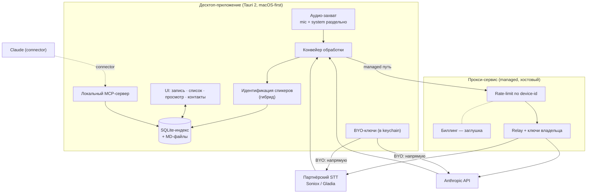

# Паспорт проекта: десктоп-утилита записи и транскрипции звонков с диаризацией

> Версия: 0.2 (Free MVP scope + инфраструктура: авто-обновление, репозиторий, деплой/релизы, dev-харнесс)
> Назначение документа: ТЗ для реализации в Claude Code. Документ описывает что строим в Free MVP, что каркасим заглушками, и что явно отложено в Paid-фазу. Claude Code должен реализовывать строго в рамках раздела «Объём» и не «чинить» сознательно принятые ограничения (см. раздел 12).
> Изменения 0.2: добавлен модуль M11 (авто-обновление), разделы 15 (репозиторий/монорепо), 16 (деплой и релизы, вердикт по Cloudflare free), 17 (девелоперский воркфлоу с ECC). Обновлены разделы 3, 7, 11, 12, 14.

---

## 1. Проблема и цель

Существующие решения (в частности Notion) транскрибируют звонки, но **не различают голоса** — транскрипт идёт сплошным текстом без атрибуции говорящих, что делает рекапы и поиск практически бесполезными.

Цель — нативная десктоп-утилита, которая:
1. Записывает звонок (микрофон и системный выход — раздельными дорожками).
2. Транскрибирует с диаризацией (разделением спикеров).
3. Сопоставляет спикеров с реальными людьми из локальной адресной книги (гибридно: голосовой отпечаток + контекстная подсказка LLM, подтверждение пользователем).
4. Хранит расшифровки, рекапы, МоМ и задачи локально.
5. Даёт Claude доступ к локальной базе звонков через MCP для умного поиска и Q&A.

---

## 2. Глоссарий

| Термин | Определение |
|---|---|
| **Сессия записи** | Один акт записи: от нажатия Record до Stop. Порождает один или несколько артефактов звонка. |
| **Звонок (Call)** | Логическая запись: метаданные + аудиофайлы (mic-дорожка, system-дорожка) + транскрипт + рекап. |
| **Дорожка** | Отдельный аудиопоток. `mic` = микрофон пользователя (всегда = владелец). `system` = системный выход (дальняя сторона). |
| **Спикер (Speaker)** | Кластер реплик, выделенный диаризацией (Speaker 0, Speaker 1...). До привязки — анонимен. |
| **Контакт (Contact)** | Запись адресной книги: человек + произвольные поля + голосовые отпечатки (семплы). |
| **Семпл / отпечаток (Embedding)** | Векторное представление голоса спикера для матчинга. Обновляется из подтверждённых привязок. |
| **Рекап (Recap)** | Сжатая выжимка звонка: ключевое, решения, участники. MD-файл. |
| **МоМ (MoM)** | Minutes of Meeting — структурированный протокол. Входит в рекап-файл. |
| **Задачи (Action items)** | Список задач с привязкой к ответственному (контакту). |
| **Прокси (Proxy)** | Хостовый relay-сервис: добавляет ключи владельца, считает квоту по device-id, точка будущей тарификации. |
| **BYO-ключи** | Bring Your Own keys. Пользователь подключает свои ключи партнёрских API; запросы идут **напрямую из приложения мимо прокси**. |
| **Device-id** | Анонимный UUID установки, генерируется при первом запуске, хранится локально, отправляется в прокси для учёта квоты Free-тира. |

---

## 3. Объём (Scope)

Каждое требование помечено: **[MVP]** реализуем сразу · **[SCAFFOLD]** каркас/заглушка, интерфейс есть, логики нет · **[DEFERRED]** не делаем, только зафиксировано для архитектуры.

| Область | Статус | Комментарий |
|---|---|---|
| Захват аудио macOS (mic + system раздельно) | **[MVP]** | Core Audio process tap |
| Захват аудио Windows | **[SCAFFOLD]** | Trait `AudioCapture`, Windows-impl возвращает `NotImplemented` |
| Ручной триггер записи (кнопка) | **[MVP]** | |
| Авто-детект звонка → предложить запись | **[DEFERRED]** | Эвристика, ненадёжно, отдельная фаза |
| Транскрипция + диаризация через прокси | **[MVP]** | Партнёрский STT (Soniox primary, Gladia fallback) |
| Транскрипция через BYO-ключ (напрямую) | **[MVP]** | |
| Генерация рекап/МоМ/задачи через прокси | **[MVP]** | Anthropic API |
| Генерация через BYO-ключ Anthropic (напрямую) | **[MVP]** | |
| Гибридная идентификация спикеров (подсказка + подтверждение) | **[MVP]** | |
| Адресная книга + голосовые семплы | **[MVP]** | |
| Динамическое обновление семплов из подтверждений | **[MVP]** | |
| Хранение: SQLite-индекс + MD-файлы | **[MVP]** | |
| UI: запись, список звонков, просмотр расшифровки/рекапа, контакты | **[MVP]** | |
| Локальный MCP-сервер (read-only) для Claude | **[MVP]** | |
| Прокси-сервис: relay + квота по device-id | **[MVP]** | |
| Биллинг / тарификация в прокси | **[SCAFFOLD]** | Заглушка: эндпоинт `/usage` отдаёт счётчики, тарифов нет |
| Free / Paid тиры, overage | **[SCAFFOLD]** | Конфиг тира захардкожен `free`; ветки под `paid` помечены TODO |
| Аутентификация (Apple / Google / Microsoft SSO) | **[SCAFFOLD]** | Логин работает, аккаунт создаётся, но ничего не разблокирует |
| Облачное хранение звонков | **[DEFERRED]** | Paid-фаза; локальная схема проектируется sync-friendly |
| Авто-обновление приложения (проверка версии при старте) | **[MVP]** | Tauri updater, подписанные релизы; см. M11 и раздел 16 |
| Релиз-пайплайн CI/CD (приложение + прокси) | **[MVP]** | GitHub Actions, монорепо; см. разделы 15–16 |
| Apple-нотаризация macOS-сборки | **[DEFERRED]** | Решение зафиксировано в разделе 12 (R6); MVP — без нотаризации |
| Монорепо + общие контракты | **[MVP]** | См. раздел 15 |
| ECC как dev-харнесс (не часть продукта) | **[MVP-dev]** | Зафиксирован и запинен; см. раздел 17 |

---

## 4. Архитектура



### 4.1 Принципы

- **Локальное-первое**: всё ядро (запись, хранение, просмотр, MCP) работает офлайн и без аккаунта. Сеть нужна только для STT/LLM.
- **Два пути к партнёрским API**:
  - *Managed*: приложение → прокси (ключи владельца, квота) → партнёр.
  - *BYO*: приложение → партнёр напрямую (ключ пользователя из keychain, прокси не задействован, квота не считается).
  - Выбор пути — на уровне настроек; реализуется как два провайдера за единым интерфейсом `TranscriptionProvider` / `LlmProvider`.
- **Слой захвата за абстракцией**: trait `AudioCapture` с реализациями `MacOsCoreAudioCapture` (MVP) и `WindowsWasapiCapture` (SCAFFOLD, `unimplemented`).
- **Идентификация — только подсказка**: пайплайн никогда не присваивает контакт автоматически; всегда формирует ранжированные предложения, финальное решение за пользователем.

---

## 5. Технологический стек

| Слой | Выбор | Обоснование |
|---|---|---|
| Оболочка | Tauri 2 | Лёгкий бинарь, Rust-ядро, веб-фронт; нативные sidecar-бинарики поддерживаются |
| Фронтенд | TypeScript + (React или Svelte на усмотрение реализации) | Знакомый стек заказчика |
| Ядро/IPC | Rust (Tauri commands) | Аудио, файлы, БД, вызовы провайдеров |
| Захват аудио macOS | Swift sidecar на Core Audio process tap (по образцу AudioTee), вывод PCM в stdout | Решённый паттерн для macOS 14.2+ |
| Хранилище структуры | SQLite (через `sqlx` или аналог) + FTS5 | Индекс, поиск, контакты, эмбеддинги |
| Хранилище контента | MD-файлы на диске | Человекочитаемо, отдаётся в Claude/MCP как есть |
| Векторный матчинг | Косинусная близость в коде; опц. `sqlite-vec` для масштаба | Эмбеддинги маленькие, можно в памяти |
| STT/диаризация | Soniox (primary), Gladia (fallback) | Бандл-цена, диаризация язык-независимая, code-switching RU/KK/EN |
| LLM (рекап/МоМ/догадка) | Anthropic API; модель конфигурируема через env | Заказчик уже работает в экосистеме Claude |
| Прокси | Лёгкий сервис (Hono на Cloudflare Workers — знакомый стек; или Node/Bun) | Relay + квота; деплой минимальный |
| Auth | OAuth2/OIDC (Apple, Google, Microsoft) через прокси-бэкенд | Обмен кодов и редиректы нельзя безопасно делать в десктопе |

> Примечание по STT: перед фиксацией провайдера прогнать реальные звонки заказчика (русский с казахскими вкраплениями) через Soniox и Gladia и сравнить **диаризацию на наложениях речи**. Интерфейс `TranscriptionProvider` делает провайдера сменным — выбор не блокирует разработку.

---

## 6. Модель данных

### 6.1 Раскладка файлов

```
<app_data_dir>/
  app.db                         # SQLite: индекс, контакты, эмбеддинги, настройки, очередь
  device.json                    # device-id (UUID), создаётся при первом запуске
  calls/
    <call_id>/
      mic.wav                    # дорожка микрофона (16 kHz mono)
      system.wav                 # дорожка системного выхода
      transcript.md              # полная диаризованная расшифровка
      recap.md                   # рекап + МоМ + задачи + участники
      raw_stt.json               # сырой ответ STT (для пере-генерации без повторной оплаты)
  contacts/
    <contact_id>/
      avatar.*                   # опционально
```

### 6.2 Схема SQLite (ориентир, не дословно)

```sql
-- Контакты (телефонная книга с расширяемыми полями)
CREATE TABLE contacts (
  id            TEXT PRIMARY KEY,        -- uuid
  display_name  TEXT NOT NULL,
  is_owner      INTEGER NOT NULL DEFAULT 0,  -- 1 = владелец приложения (mic-дорожка)
  org           TEXT,
  role          TEXT,
  attributes    TEXT,                    -- JSON: произвольные расширяемые поля
  notes         TEXT,
  created_at    TEXT NOT NULL,
  updated_at    TEXT NOT NULL
);

CREATE TABLE contact_identifiers (        -- телефоны/почты/мессенджеры
  id          TEXT PRIMARY KEY,
  contact_id  TEXT NOT NULL REFERENCES contacts(id) ON DELETE CASCADE,
  kind        TEXT NOT NULL,             -- phone | email | telegram | ...
  value       TEXT NOT NULL
);

-- Голосовые отпечатки. Несколько на контакт; обновляются из подтверждённых привязок.
CREATE TABLE voice_samples (
  id          TEXT PRIMARY KEY,
  contact_id  TEXT NOT NULL REFERENCES contacts(id) ON DELETE CASCADE,
  embedding   BLOB NOT NULL,             -- float32[]
  source_call TEXT,                      -- из какого звонка получен
  quality     REAL,                      -- уверенность/качество сегмента
  created_at  TEXT NOT NULL
);

CREATE TABLE calls (
  id           TEXT PRIMARY KEY,
  title        TEXT,
  started_at   TEXT NOT NULL,
  ended_at     TEXT,
  duration_sec INTEGER,
  status       TEXT NOT NULL,            -- recording|processing|ready|failed
  provider     TEXT,                     -- soniox|gladia|...
  path_label   TEXT NOT NULL,            -- managed|byo
  lang_detected TEXT,
  created_at   TEXT NOT NULL,
  updated_at   TEXT NOT NULL
);

CREATE TABLE call_speakers (              -- спикер внутри звонка и его привязка
  id           TEXT PRIMARY KEY,
  call_id      TEXT NOT NULL REFERENCES calls(id) ON DELETE CASCADE,
  speaker_tag  TEXT NOT NULL,            -- 'Speaker 0' и т.п.
  contact_id   TEXT REFERENCES contacts(id),  -- NULL пока не подтверждено
  suggestion_contact_id TEXT,            -- подсказка системы
  suggestion_score REAL,                 -- 0..1
  suggestion_source TEXT,                -- embedding|llm|both
  confirmed    INTEGER NOT NULL DEFAULT 0,
  embedding    BLOB                      -- усреднённый эмбеддинг кластера в этом звонке
);

CREATE TABLE action_items (
  id           TEXT PRIMARY KEY,
  call_id      TEXT NOT NULL REFERENCES calls(id) ON DELETE CASCADE,
  text         TEXT NOT NULL,
  owner_contact_id TEXT REFERENCES contacts(id),
  due          TEXT,
  done         INTEGER NOT NULL DEFAULT 0
);

CREATE TABLE settings (                   -- ключ-значение: путь (managed/byo), провайдер, лимиты UX и т.п.
  key TEXT PRIMARY KEY, value TEXT
);

-- Полнотекстовый поиск по контенту звонков
CREATE VIRTUAL TABLE call_fts USING fts5(call_id, title, transcript, recap);

-- BYO-ключи в системном keychain, НЕ в БД. В settings — только флаги наличия.
```

---

## 7. Функциональные требования по модулям

### M1. Захват аудио **[MVP / SCAFFOLD]**
- M1.1 Trait `AudioCapture { start(), stop() -> CaptureResult }`.
- M1.2 macOS-реализация: Core Audio process tap, **две независимые дорожки** `mic.wav` и `system.wav`, 16 kHz mono PCM/WAV.
- M1.3 Запрос системных разрешений (микрофон; системный аудио-тап) с понятным UX, обработка отказа.
- M1.4 Windows-реализация — `unimplemented!()` за тем же trait, UI показывает «недоступно на этой платформе».
- M1.5 Индикатор записи, длительность, кнопка Stop. Аварийное завершение не теряет уже записанное (флаш на диск чанками).

### M2. Транскрипция и диаризация **[MVP]**
- M2.1 Единый интерфейс `TranscriptionProvider { transcribe(audio, opts) -> DiarizedTranscript }`.
- M2.2 Реализации: `SonioxProvider`, `GladiaProvider`. Выбор провайдера — настройка.
- M2.3 Два пути доставки: *managed* (через прокси) и *byo* (напрямую, ключ из keychain). Путь — настройка.
- M2.4 Вход: дорожка `system` обязательно диаризуется. Дорожка `mic` помечается как владелец без диаризации и сливается в общий таймлайн по таймкодам.
- M2.5 Сырой ответ STT сохраняется в `raw_stt.json` — повторная генерация рекапа не должна требовать повторной оплаты транскрипции.
- M2.6 Язык: автоопределение + поддержка code-switching; язык фиксируется в `calls.lang_detected`.
- M2.7 Ретраи с backoff, понятные ошибки в UI (квота, сеть, ключ).

### M3. Идентификация спикеров (гибрид) **[MVP]**
- M3.1 Для каждого спикера в `system`-дорожке — вычислить эмбеддинг кластера.
- M3.2 Матчинг эмбеддинга против `voice_samples` всех контактов (косинус) → топ-кандидат + score.
- M3.3 Параллельно: диаризованный транскрипт → LLM, запрос «по обращениям/контексту предположи, кто какой спикер из списка известных контактов».
- M3.4 Слияние сигналов в одно ранжированное предложение на спикера: `suggestion_contact_id`, `suggestion_score`, `suggestion_source`.
- M3.5 UI показывает предложения; пользователь подтверждает/исправляет/создаёт новый контакт. Никакой автопривязки без подтверждения.
- M3.6 При подтверждении: эмбеддинг кластера дописывается в `voice_samples` подтверждённого контакта (динамическое обновление семпла). Политика: хранить N последних качественных семплов на контакт (N конфигурируем, дефолт 5), низкокачественные отбрасывать.
- M3.7 Mic-дорожка всегда привязана к контакту-владельцу (`is_owner=1`) без подтверждения.

### M4. Генерация рекапа / МоМ / задач **[MVP]**
- M4.1 Интерфейс `LlmProvider { generate(prompt, transcript) -> Json }`, провайдер Anthropic, путь managed/byo как в M2.
- M4.2 Один структурированный вызов на готовом (после M3) транскрипте, на выходе JSON: `summary`, `key_points`, `mom`, `action_items[] {text, owner_hint}`, `participants[]`.
- M4.3 `owner_hint` маппится на `contacts.id` (по подтверждённым привязкам спикеров); при неоднозначности — оставить текстом и пометить для ручной привязки.
- M4.4 Сборка `recap.md` (рекап + МоМ + задачи по ответственным + список участников) и `transcript.md` (полная диаризованная расшифровка с подписанными именами).
- M4.5 Перегенерация рекапа из `raw_stt.json` без обращения к STT.

### M5. Хранение **[MVP]**
- M5.1 SQLite — индекс/структура/поиск; MD-файлы — контент. SQLite является источником истины для структурированных данных, MD — для человекочитаемого контента и для отдачи в Claude.
- M5.2 При изменении транскрипта/рекапа — синхронно обновлять `call_fts`.
- M5.3 Схема проектируется sync-friendly (uuid-ключи, `updated_at`) для будущей облачной синхронизации (DEFERRED), но логики синка в MVP нет.
- M5.4 Удаление звонка — мягкое подтверждение в UI; физическое удаление файлов и записей. (Никакого автоочищения.)

### M6. Контакты и семплы **[MVP]**
- M6.1 CRUD контактов; произвольные расширяемые поля (`attributes` JSON); несколько идентификаторов (тел/почта/мессенджеры).
- M6.2 Контакт-владелец создаётся при первом запуске (онбординг), помечается `is_owner`.
- M6.3 Просмотр голосовых семплов контакта, ручное удаление отдельных семплов.
- M6.4 Импорт контактов — **[DEFERRED]** (зафиксировать точку расширения, не реализовывать).

### M7. UI **[MVP]**
- M7.1 Экран записи: старт/стоп, статус обработки, выбор пути (managed/byo) и провайдера.
- M7.2 Список звонков: дата, заголовок, длительность, участники, статус; поиск (FTS).
- M7.3 Карточка звонка: вкладки «Рекап», «Расшифровка», «Задачи», «Участники»; экран подтверждения привязок спикеров.
- M7.4 Адресная книга: список/карточка контакта/семплы.
- M7.5 Настройки: путь и провайдеры, BYO-ключи (ввод в keychain), аккаунт (см. M10), индикатор квоты Free (из `/usage`, информативно).
- M7.6 Онбординг: создание контакта-владельца, выдача разрешений на аудио.

### M8. Локальный MCP-сервер **[MVP]**
- M8.1 Встроенный/локальный MCP-сервер, подключается как connector в Claude.
- M8.2 Только чтение в MVP. Инструменты:
  - `search_calls(query, limit)` — FTS по транскриптам/рекапам.
  - `get_call(call_id)` — метаданные + участники + ссылки на контент.
  - `get_recap(call_id)` — содержимое `recap.md`.
  - `get_transcript(call_id)` — содержимое `transcript.md`.
  - `list_participants(call_id)` — контакты-участники.
  - `find_calls_by_contact(contact_id)` — звонки с участием контакта.
  - `calls_in_range(from, to)` — по датам.
- M8.3 Сервер не имеет инструментов записи/удаления (безопасность, защита от инъекций из контента звонков).
- M8.4 Доступ только к локальной БД текущего пользователя; никаких сетевых вызовов из MCP-сервера.

### M9. Прокси-сервис **[MVP + SCAFFOLD]**
- M9.1 Эндпоинты: `POST /stt`, `POST /llm` — relay на партнёрский API с подстановкой ключей владельца.
- M9.2 Идентификация запроса по `device-id` (заголовок). Анонимно, без аккаунта.
- M9.3 Rate-limit / квота на `device-id` (Free-тир). Конфиг тира захардкожен `free`.
- M9.4 `GET /usage` — счётчики использования по device-id (для индикатора в UI). Тарифов/оплаты нет — **[SCAFFOLD]**.
- M9.5 Ветки для `paid`-тира и overage в коде помечены `// TODO: paid` и не исполняются.
- M9.6 Прокси **не логирует** содержимое аудио/транскриптов сверх минимально необходимого для метрик; не хранит контент.
- M9.7 BYO-путь прокси не обслуживает (приложение ходит напрямую) — прокси не должен видеть пользовательские ключи.

### M10. Аутентификация **[SCAFFOLD]**
- M10.1 SSO: Apple, Google, Microsoft (OIDC). Обмен кодов — на стороне прокси-бэкенда.
- M10.2 Логин работает, создаётся запись аккаунта, связывается с device-id.
- M10.3 В MVP аккаунт **ничего не разблокирует** — это задел под облачное хранение/синхронизацию (DEFERRED). Локальный режим полностью функционален без аккаунта.
- M10.4 Выход/смена аккаунта; локальные данные при этом не трогаются.

### M11. Авто-обновление приложения **[MVP]**
- M11.1 Плагин `tauri-plugin-updater` (v2). Подпись обновлений **обязательна** (Tauri-ключ minisign), отключить нельзя. Ключевая пара генерируется `tauri signer generate`; приватный ключ — только в CI-секрете (`TAURI_SIGNING_PRIVATE_KEY` + пароль), публичный — в `tauri.conf.json`.
- M11.2 `bundle.createUpdaterArtifacts = true`. Манифест `latest.json` генерируется `tauri-action` (`includeUpdaterJson: true`).
- M11.3 Endpoint обновлений: GitHub Releases (`https://github.com/<owner>/<repo>/releases/latest/download/latest.json`) для MVP. Точка расширения: тонкий Cloudflare-Worker-эндпоинт (паттерн egoist/tauri-updater) для контроля каналов/раскатки — заложить интерфейсно, не реализовывать в MVP.
- M11.4 Проверка версии — **при старте приложения, неблокирующая** (фоновая): если доступна новая версия — ненавязчивый промпт «обновить сейчас / позже» с release notes из `latest.json`; по согласию `downloadAndInstall()` + graceful `relaunch()`.
- M11.5 Версия синхронизирована в трёх местах: `Cargo.toml`, `tauri.conf.json`, `package.json`. CI проверяет совпадение и падает при рассинхроне.
- M11.6 Capabilities/permissions для updater и process прописаны в `src-tauri/capabilities`.
- M11.7 Канал релизов: `stable` по умолчанию. Поле `channel` зарезервировано в манифесте/конфиге для будущего `beta` — **[SCAFFOLD]**, не реализовывать.
- M11.8 Откат: поддержать `version_comparator` (downgrade-режим) как аварийный механизм отката плохого релиза. Документировать процедуру, в UI не выставлять.
- M11.9 Потеря приватного Tauri-ключа = невозможность доставлять обновления существующим установкам. Ключ хранится в менеджере секретов + офлайн-бэкап. Зафиксировать в README репозитория.

---

## 8. Нефункциональные требования

- **Офлайн**: запись, просмотр, поиск, MCP, контакты — без сети. Сеть только для STT/LLM.
- **Приватность по умолчанию**: голосовые семплы и аудио — только локально. Никакой отправки семплов/контента в облако в MVP (нет облака). BYO-ключи — только в системном keychain, не в БД, не в логах.
- **Производительность**: обработка часового звонка не блокирует UI (фоновая очередь, статусы). Поиск по FTS — мгновенный на тысячах звонков.
- **Надёжность записи**: потеря питания/краш не уничтожает уже записанное (чанковый флаш).
- **Безопасность MCP**: read-only, без сетевых вызовов, контент звонков рассматривается как недоверенные данные (защита от инструкций-инъекций внутри расшифровок — сервер не исполняет ничего из контента).
- **Сменяемость провайдеров**: STT/LLM за интерфейсами; смена провайдера не требует изменения ядра.

---

## 9. Ограничения, право и приватность (constraints)

> Эта секция — требования, а не дисклеймер. Реализовать как поведение приложения.

- **C1. Согласие на запись.** При первом запуске и периодически — явное информирование о юридической ответственности за запись разговоров; запись стартует только по явному действию пользователя. Никакой скрытой/автоматической записи.
- **C2. Биометрия третьих лиц.** Голосовой отпечаток — биометрические данные. Создание семпла контакта — **opt-in** на уровне контакта (флаг «разрешено накапливать голосовой профиль»), по умолчанию выключено для новых контактов, кроме владельца. Без флага — диаризация работает, но семплы не сохраняются.
- **C3. Локальность данных.** Семплы и аудио не покидают устройство в MVP. Облачные функции (DEFERRED) при появлении должны быть явным opt-in с указанием резидентности данных.
- **C4. Прокси и контент.** Прокси не хранит и не логирует контент; только метрики по device-id.
- **C5. Удаление.** Полное удаление звонка должно удалять и аудио, и семплы, происходящие из него (или помечать их происхождение, чтобы пользователь мог вычистить).

---

## 10. Контракт прокси (ориентир)

```
POST /v1/stt
  headers: x-device-id
  body:    multipart (audio) | url, opts {provider, diarization:true, lang:auto}
  -> 200 { transcript: DiarizedTranscript } | 429 quota | 5xx

POST /v1/llm
  headers: x-device-id
  body:    { model?, system, input }   # input = диаризованный транскрипт
  -> 200 { json: {...} } | 429 quota | 5xx

GET /v1/usage
  headers: x-device-id
  -> 200 { tier:"free", stt_seconds_used, llm_tokens_used, period_reset_at }
  # тарифы/оплата отсутствуют (SCAFFOLD)
```

BYO-путь использует те же структуры `DiarizedTranscript` / LLM-JSON, но вызывает партнёрский API напрямую из приложения.

---

## 11. Этапы реализации (для Claude Code, по порядку)

Каждый этап — самостоятельно проверяемый инкремент.

1. **Каркас.** Tauri 2 проект, структура папок, SQLite + миграции (раздел 6), trait’ы `AudioCapture`/`TranscriptionProvider`/`LlmProvider`, device-id онбординг, контакт-владелец.
2. **Захват macOS.** Swift sidecar (Core Audio tap), две дорожки, разрешения, экран записи, сохранение `calls/<id>/*.wav`. Критерий: записанный тестовый звонок даёт два валидных WAV.
3. **Транскрипция (managed + byo).** `SonioxProvider` + `GladiaProvider`, оба пути доставки, `raw_stt.json`, `transcript.md` без имён. Критерий: звонок → диаризованный транскрипт в файле.
4. **Идентификация (гибрид).** Эмбеддинги кластеров, матчинг по `voice_samples`, LLM-подсказка, слияние, UI подтверждения, дозапись семплов. Критерий: после подтверждения второй звонок с тем же человеком даёт корректную подсказку.
5. **Рекап/МоМ/задачи.** LLM-вызов, `recap.md`, `action_items`, привязка к ответственным, перегенерация из `raw_stt.json`.
6. **UI полный.** Список, карточка звонка, поиск (FTS), адресная книга, настройки, индикатор квоты.
7. **MCP-сервер.** Локальный read-only сервер с инструментами раздела 8, инструкция по подключению как connector.
8. **Прокси-сервис.** Relay `/stt` `/llm`, квота по device-id, `/usage`, заглушки `paid`.
9. **Auth scaffold.** SSO Apple/Google/Microsoft, создание аккаунта, связка с device-id (ничего не разблокирует).
10. **Constraints.** Реализовать C1–C5 как поведение (согласие, opt-in биометрия, каскадное удаление).
11. **Авто-обновление (M11).** Updater-плагин, генерация ключей, `latest.json` через `tauri-action`, неблокирующая проверка при старте, промпт обновления. Критерий: сборка vN установлена, опубликован vN+1 — приложение при старте предлагает и ставит обновление.
12. **CI/CD и релизы.** Монорепо-структура (раздел 15), GitHub Actions: build+sign приложения → GitHub Release с `latest.json`; деплой прокси в Cloudflare; проверка синхронизации версий; раздельные скоупы секретов (раздел 16). Критерий: тег `vX.Y.Z` → собранный подписанный релиз + задеплоенный прокси без ручных шагов.

> Порядок: этапы 11–12 можно вести параллельно с 6–10, но обязательны до релиза MVP. Каркас CI (этап 12, пустой пайплайн) желательно поднять сразу после этапа 1, чтобы не накапливать релизный долг.

---

## 12. Сознательно принятые ограничения (НЕ «чинить» в MVP)

Claude Code не должен самостоятельно усложнять эти места — они приняты осознанно:

- **R1. Free-тир без аккаунта абьюзится переустановкой** (сброс device-id). Принято для MVP. Митигации на потом (не реализовывать): требование аккаунта для Free, привязка к более стабильному идентификатору устройства, прогрев лимита. Зафиксировать `// TODO(abuse): see Паспорт R1`.
- **R2. Контекстная LLM-догадка спикеров ненадёжна** как самостоятельный сигнал — поэтому она только booster и всегда требует подтверждения. Не делать её автоприсвоением.
- **R3. Авто-детект «идёт звонок»** не реализуется — только ручная кнопка.
- **R4. Windows-захват** — заглушка. Не пытаться реализовать в MVP.
- **R5. Биллинг/тиры** — заглушки. Не строить платёжную логику.
- **R6. macOS-сборка без Apple-нотаризации в MVP.** Tauri-подпись обновлений ≠ Apple Developer ID + нотаризация — это разные вещи. Без нотаризации Gatekeeper потребует ручного «Open anyway» при первом запуске. Принято для MVP (нет Apple Developer Program). Не пытаться обходить Gatekeeper. Документировать процедуру первого запуска для пользователя. Точка перехода: подключить Apple Developer ID + `notarytool` в CI (раздел 16) — отдельной задачей, когда появится аккаунт. Маркер: `// TODO(notarize): see Паспорт R6`.
- **R7. Free Cloudflare: при превышении воркер перестаёт отвечать, без списаний.** Это принятое поведение MVP, не баг. Не строить авто-апгрейд тарифа и не усложнять архитектуру ради обхода лимитов. Переход на Workers Paid ($5/мес) — это смена тарифа без изменения кода (раздел 16).
- **R8. Аудио не проходит через память прокси-воркера.** Стейджинг только через R2 + presigned-URL (раздел 16). Не реализовывать стриминг аудио-байтов через воркер «чтобы проще» — это упрётся в лимиты и потребует переделки.

---

## 13. Открытые вопросы (решить до/во время реализации)

- O1. Финальный STT-провайдер по умолчанию — после теста реальных звонков заказчика (Soniox vs Gladia на казахско-русском с наложениями). До решения — Soniox default, Gladia доступен в настройках.
- O2. Модель Anthropic по умолчанию для рекапа — конфиг через env; конкретную модель уточнить на момент реализации (актуальная Claude-модель).
- O3. Библиотека голосовых эмбеддингов (например, pyannote-класс) — выбрать с учётом запуска как локального sidecar; зафиксировать в этапе 4.
- O4. Хранить ли усреднённый эмбеддинг или N последних — принято: N последних качественных (M3.6), N=5 по умолчанию, вынести в settings.

---

## 14. Критерии приёмки Free MVP

MVP считается готовым, когда:
1. На macOS можно записать звонок (mic+system раздельно) по кнопке.
2. Звонок транскрибируется с диаризацией обоими путями (managed через прокси и BYO напрямую).
3. Спикеры получают ранжированные подсказки (отпечаток + LLM), пользователь подтверждает, семплы дозаписываются, повторная встреча с тем же контактом даёт верную подсказку.
4. Генерируются `recap.md` (рекап+МоМ+задачи по ответственным+участники) и `transcript.md`.
5. Список и полнотекстовый поиск по звонкам работают офлайн.
6. Адресная книга с расширяемыми полями и семплами работает; контакт-владелец заведён.
7. Локальный MCP-сервер подключается в Claude и отвечает на поиск/Q&A по локальной базе.
8. Прокси relay’ит с квотой по device-id; `/usage` отдаёт счётчики; биллинг/тиры/auth — рабочие заглушки, не блокирующие локальный сценарий.
9. Constraints C1–C5 реализованы как поведение приложения.
10. Авто-обновление работает: при старте обнаруживается опубликованный новый релиз, ставится по согласию пользователя, приложение перезапускается на новой версии.
11. Тег `vX.Y.Z` в монорепо запускает CI, который собирает и подписывает приложение, публикует GitHub Release с `latest.json` и деплоит прокси в Cloudflare — без ручных шагов; версии в трёх файлах синхронны (CI это проверяет).

---

## 15. Репозиторий и структура

**Решение: монорепо.** Контракты (`DiarizedTranscript`, JSON рекапа/МоМ, формат `latest.json`) общие между приложением и прокси. Полирепо потребует ручной синхронизации контрактов между репозиториями — это прямой источник «многократных переделок» и рассинхрона. Монорепо с воркспейсами и общим пакетом типов это снимает.

Структура (ориентир):

```
repo/
  Cargo.toml                     # cargo workspace
  package.json                   # pnpm workspace root
  pnpm-workspace.yaml
  apps/
    desktop/                     # Tauri 2 приложение
      src/                       # фронтенд (TS)
      src-tauri/                 # Rust-ядро, capabilities, tauri.conf.json
      sidecars/macos-audio/      # Swift sidecar (Core Audio tap)
  services/
    proxy/                       # Hono на Cloudflare Workers (relay + квота)
    mcp/                         # локальный MCP-сервер (если выносится отдельным бинарём)
  packages/
    contracts/                   # ОБЩИЕ типы/схемы: транскрипт, рекап, API прокси, latest.json
  .github/workflows/             # CI/CD (раздел 16)
  .claude/                       # dev-харнесс ECC (раздел 17), в т.ч. rules/, плагин-конфиг
  CLAUDE.md                      # навигация по репо для агента + ссылка на этот паспорт
```

Правила:
- **S1. Изоляция секретов.** Секреты партнёрских API (Soniox/Gladia/Anthropic) и Tauri-приватный ключ привязаны к разным CI-джобам. Ключи партнёров доступны **только** джобе деплоя прокси и физически недоступны сборке приложения. Tauri-приватный ключ доступен только джобе сборки приложения. Никаких общих «repo-wide» секретов для этих значений.
- **S2. Единый пакет контрактов.** Любое изменение формата транскрипта/рекапа/API прокси правится в `packages/contracts` и потребляется и приложением, и прокси. Дублирование типов запрещено.
- **S3. Path-filtered CI.** Изменения в `apps/desktop` запускают сборку/релиз приложения; в `services/proxy` — деплой прокси; в `packages/contracts` — оба (контракт затрагивает обе стороны).
- **S4. `CLAUDE.md` в корне** — точка входа для Claude Code: краткая карта репо, стек, ссылка на `ПАСПОРТ_ПРОЕКТА.md` как источник истины по требованиям, и явное указание читать раздел 12 (принятые ограничения) перед изменениями.

---

## 16. Деплой и релизы

### 16.1 Два деплой-таргета

| Артефакт | Куда | Как |
|---|---|---|
| Десктоп-приложение | GitHub Releases | `tauri-action` в GitHub Actions: build + sign + публикация релиза с `latest.json` |
| Прокси-сервис | Cloudflare Workers | `wrangler deploy` из CI; стейджинг аудио — R2 bucket |
| Манифест обновлений | GitHub Releases (`latest.json`) | Endpoint в `tauri.conf.json` (см. M11.3) |

### 16.2 Вердикт по бесплатному Cloudflare

**Бесплатного тарифа достаточно для MVP и небольшой пользовательской базы** при условии правильной архитектуры с самого начала (иначе упрётесь и придётся переделывать):

- Workers Free: 100k запросов/день; CPU-лимит 10мс на инвокацию, **но длительность запроса не лимитирована** — ожидание ответа партнёрского API не тратит CPU. Тонкий relay укладывается в 10мс CPU, т.к. он только проксирует, а не вычисляет.
- **Аудио НЕ проходит через память воркера** (см. R8). Поток: приложение запрашивает у прокси presigned-PUT → льёт аудио напрямую в R2 → прокси отдаёт партнёру (Soniox/Gladia) URL R2-объекта на async-задачу → партнёр сам забирает аудио из R2 → прокси возвращает приложению готовый транскрипт (маленький JSON). R2 egress (в т.ч. через Workers/S3 API) бесплатный.
- LLM-релей: только текст, мизерные пейлоады — тривиально в пределах free.
- Счётчики квоты по device-id: Workers KV (free) — простые инкременты.
- Очистка стейджинга R2: правилами lifecycle бакета (Cron на free недоступен — не закладывать Cron-зависимости).
- Превышение лимитов: воркер перестаёт отвечать без списаний (R7). Это триггер апгрейда на Workers Paid ($5/мес) — смена тарифа, не переписывание.

Точки, которые НЕ должны зависеть от платного тарифа в MVP: Cron Triggers, Durable Objects (кроме SQLite-backed), длительные синхронные операции в воркере. Если фича требует чего-то из этого — это сигнал к пересмотру дизайна, а не к апгрейду.

### 16.3 Релизный процесс

1. Бамп версии в `Cargo.toml` + `tauri.conf.json` + `package.json` (одной задачей; CI проверяет синхронность — M11.5).
2. Тег `vX.Y.Z` → GitHub Actions:
   - джоба `app`: `tauri-action` собирает и подписывает (Tauri-ключ из секрета), создаёт Release с артефактами и `latest.json`;
   - джоба `proxy`: `wrangler deploy` (партнёрские ключи из секрета этой джобы);
   - джоба `verify`: совпадение версий, smoke-проверки.
3. Пользователи получают обновление при следующем старте приложения (M11.4).
4. Откат плохого релиза: процедура через `version_comparator` downgrade (M11.8) + публикация исправленного `latest.json`.

### 16.4 macOS-нотаризация (DEFERRED — R6)

В MVP сборка не нотаризуется. Заложить в CI **место** под шаг `codesign` (Developer ID) + `notarytool` за фиче-флагом/секретом: если секреты Apple присутствуют — шаг выполняется, если нет — пропускается с предупреждением. Так подключение нотаризации позже не потребует переписывания пайплайна (это и есть «не переделывать»). Документировать для пользователя первый запуск без нотаризации.

---

## 17. Девелоперский воркфлоу: ECC (Everything Claude Code)

ECC — это **харнесс для разработки с Claude Code, не часть продукта**. В рантайме приложения его нет; он влияет только на то, как Claude Code пишет этот проект. Цель подключения — стабильное поведение агента и сохранение контекста между сессиями (прямо бьёт в задачу «не переделывать по 10 раз»).

- **W1. Установка и пин версии.** Подключить ECC как плагин Claude Code (`/plugin marketplace add https://github.com/affaan-m/everything-claude-code`, затем `/plugin install ecc@ecc`) ИЛИ OSS-способом скопировать правила в `.claude/rules/ecc/`. **Версия ECC пинуется** (зафиксировать в `CLAUDE.md` и в репо), чтобы поведение харнесса было воспроизводимым и не «уезжало» от обновлений ECC.
- **W2. Стек-правила.** Подключить наборы правил под стек проекта: `common` + `typescript` + `rust` + `swift` (приложение и sidecar). Лишние языковые наборы не тянуть (selective install).
- **W3. PDCA-цикл по каждому этапу раздела 11.** Для каждого милстоуна: `/plan` → реализация через TDD-скилл (`/tdd`) → `/code-review` → `/verify`. Не переходить к следующему этапу без зелёного `/verify`.
- **W4. Персистентность сессий.** Включить session-хуки ECC (SessionStart грузит саммари прошлой сессии, Stop сохраняет итог). Это снимает потерю контекста в длинных агентных сессиях — критично для многоэтапной реализации.
- **W5. Security-review на чувствительных модулях обязателен.** Прогонять security-скан/`/security-review` (AgentShield) на: прокси (инъекция ключей, квота), хранение/keychain (BYO-ключи), MCP-сервер (контент звонков как недоверенные данные, защита от инъекций), auth-flow. Это не опционально — модель угроз проекта включает биометрию, чужие ключи и недоверенный контент.
- **W6. ECC не переопределяет паспорт.** При конфликте рекомендаций ECC и этого документа — источник истины `ПАСПОРТ_ПРОЕКТА.md`, в особенности раздел 12. Зафиксировать это явно в `CLAUDE.md`, чтобы агент не «улучшал» принятые ограничения под влиянием общих правил харнесса.
- **W7. Граница харнесса.** `.claude/` и ECC-конфиг — в монорепо (раздел 15), но они не часть сборки/деплоя продукта и исключены из артефактов приложения и прокси.
