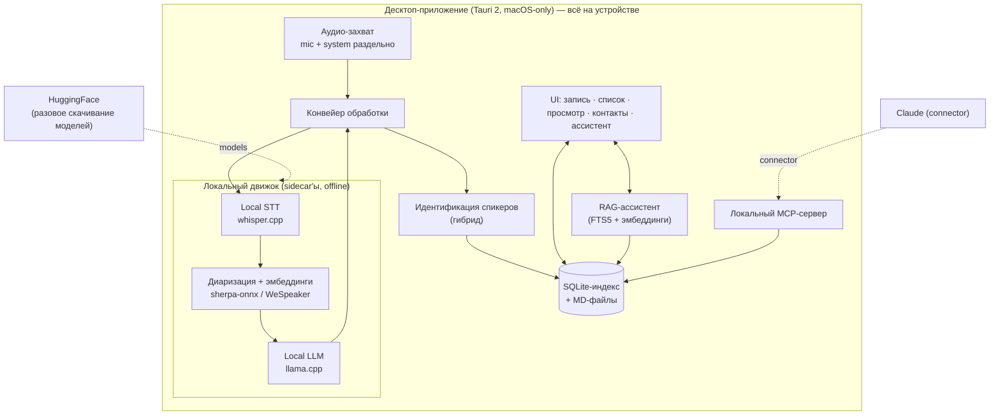

# Паспорт проекта: десктоп-утилита записи и транскрипции звонков с диаризацией

> Версия: 0.3 (переход на **local-only** — облачный сегмент удалён из кода)
> Назначение документа: ТЗ для реализации в Claude Code. Claude Code должен реализовывать строго в рамках раздела «Объём» и не «чинить» сознательно принятые ограничения (см. раздел 12).
> **Изменения 0.3 — переход на local-only.** Весь облачный сегмент удалён из кода: прокси-сервис (Cloudflare Workers), cloud STT (Soniox/Gladia), cloud LLM (Anthropic/Groq через прокси), auth/SSO (M10), квота/usage, выбор движка cloud↔local, device-id. Локальный движок (whisper.cpp + sherpa-onnx диаризация + llama.cpp, только macOS) — **единственный** путь обработки. Разделы 3, 4, 5, 10, 16 переработаны; ограничения R1/R5/R7/R8 помечены superseded (раздел 12). Будущая опциональная интеграция «внешний Claude-софт со своими ключами» — planned (см. конец раздела 4.1). Исторический контекст (managed/BYO, прокси, auth) в разделах 7–11 сохранён для трассируемости, но помечен как удалённый.
> Изменения 0.2 (исторически): добавлен модуль M11 (авто-обновление), разделы 15 (репозиторий/монорепо), 16 (деплой и релизы), 17 (девелоперский воркфлоу с ECC).

---

## 1. Проблема и цель

Существующие решения (в частности Notion) транскрибируют звонки, но **не различают голоса** — транскрипт идёт сплошным текстом без атрибуции говорящих, что делает рекапы и поиск практически бесполезными.

Цель — нативная десктоп-утилита, которая:
1. Записывает звонок (микрофон и системный выход — раздельными дорожками).
2. Транскрибирует с диаризацией (разделением спикеров) **локальным движком на устройстве** (whisper.cpp STT + sherpa-onnx диаризация) — без сети.
3. Сопоставляет спикеров с реальными людьми из локальной адресной книги (гибридно: голосовой отпечаток + контекстная подсказка локального LLM, подтверждение пользователем).
4. Генерирует рекап/МоМ/задачи локальным LLM (llama.cpp) и хранит расшифровки, рекапы, МоМ и задачи локально.
5. Даёт Claude доступ к локальной базе звонков через MCP для умного поиска и Q&A.

---

## 2. Глоссарий

| Термин | Определение |
|---|---|
| **Сессия записи** | Один акт записи: от нажатия Record до Stop. Порождает один или несколько артефактов звонка. |
| **Звонок (Call)** | Логическая запись: метаданные + аудиофайлы (mic-дорожка, system-дорожка) + транскрипт + рекап. |
| **Дорожка** | Отдельный аудиопоток. `mic` = микрофон пользователя (всегда = владелец). `system` = системный выход (дальняя сторона). |
| **Спикер (Speaker)** | Кластер реплик, выделенный диаризацией (Speaker 0, Speaker 1...). До привязки — анонимен. |
| **Контакт (Contact)** | Запись адресной книги: человек + произвольные поля + голосовые отпечатки (семплы). |
| **Семпл / отпечаток (Embedding)** | Векторное представление голоса спикера для матчинга. Обновляется из подтверждённых привязок. |
| **Рекап (Recap)** | Сжатая выжимка звонка: ключевое, решения, участники. MD-файл. |
| **МоМ (MoM)** | Minutes of Meeting — структурированный протокол. Входит в рекап-файл. |
| **Задачи (Action items)** | Список задач с привязкой к ответственному (контакту). |
| **Прокси (Proxy)** | **[REMOVED — local-only 0.3]** Был хостовый relay-сервис (ключи владельца, квота по device-id). Удалён вместе с облачным сегментом. |
| **BYO-ключи** | **[REMOVED — local-only 0.3]** Bring Your Own keys к партнёрским API. Удалено; на смену — planned внешние интеграции со своими ключами через keychain-seam (`secrets.rs`). |
| **Device-id** | **[REMOVED — local-only 0.3]** Анонимный UUID установки для учёта квоты Free-тира. Удалён вместе с прокси. |

---

## 3. Объём (Scope)

Каждое требование помечено: **[MVP]** реализуем сразу · **[SCAFFOLD]** каркас/заглушка, интерфейс есть, логики нет · **[DEFERRED]** не делаем, только зафиксировано для архитектуры.

| Область | Статус | Комментарий |
|---|---|---|
| Захват аудио macOS (mic + system раздельно) | **[MVP]** | Core Audio process tap |
| Захват аудио Windows | **[SCAFFOLD]** | Trait `AudioCapture`, Windows-impl возвращает `NotImplemented` |
| Ручной триггер записи (кнопка) | **[MVP]** | |
| Авто-детект звонка → предложить запись | **[DEFERRED]** | Эвристика, ненадёжно, отдельная фаза |
| Транскрипция + диаризация (локальный движок) | **[MVP]** | whisper.cpp STT + sherpa-onnx диаризация/эмбеддинги, на устройстве, offline |
| Генерация рекап/МоМ/задачи (локальный LLM) | **[MVP]** | llama.cpp на устройстве; качество ниже cloud (R12), UI показывает явно |
| RAG-ассистент по звонкам (локальный) | **[MVP]** | Гибридный поиск FTS5 + эмбеддинги, ответы local-LLM (M15) |
| ~~Транскрипция/LLM через прокси (managed)~~ | **[REMOVED]** | Облачный сегмент удалён (local-only 0.3) |
| ~~Транскрипция/LLM через BYO-ключ (напрямую)~~ | **[REMOVED]** | Партнёрские ключи удалены; на смену — planned внешние интеграции |
| Гибридная идентификация спикеров (подсказка + подтверждение) | **[MVP]** | |
| Адресная книга + голосовые семплы | **[MVP]** | |
| Динамическое обновление семплов из подтверждений | **[MVP]** | |
| Хранение: SQLite-индекс + MD-файлы | **[MVP]** | |
| UI: запись, список звонков, просмотр расшифровки/рекапа, контакты | **[MVP]** | |
| Локальный MCP-сервер (read-only) для Claude | **[MVP]** | |
| ~~Прокси-сервис: relay + квота по device-id~~ | **[REMOVED]** | `services/proxy` удалён целиком (local-only 0.3) |
| ~~Биллинг / тарификация в прокси~~ | **[REMOVED]** | Удалено вместе с прокси |
| ~~Free / Paid тиры, overage~~ | **[REMOVED]** | Удалено вместе с прокси |
| ~~Аутентификация (Apple / Google / Microsoft SSO)~~ | **[REMOVED]** | Auth-flow (M10) удалён; локальный режим аккаунта не требует |
| ~~Облачное хранение звонков~~ | **[REMOVED]** | Облачное направление снято; хранение — только локально |
| Авто-обновление приложения (проверка версии при старте) | **[MVP]** | Tauri updater, подписанные релизы; см. M11 и раздел 16 |
| Релиз-пайплайн CI/CD (приложение) | **[MVP]** | GitHub Actions; деплой прокси удалён (local-only). См. разделы 15–16 |
| Apple-нотаризация macOS-сборки | **[DEFERRED]** | Решение зафиксировано в разделе 12 (R6); MVP — без нотаризации |
| Монорепо + общие контракты | **[MVP]** | См. раздел 15 |
| ECC как dev-харнесс (не часть продукта) | **[MVP-dev]** | Зафиксирован и запинен; см. раздел 17 |

---

## 4. Архитектура



### 4.1 Принципы

- **Локальное-первое (и единственное)**: всё ядро (запись, транскрипция, диаризация, саммари, поиск, ассистент, хранение, просмотр, MCP) работает офлайн и без аккаунта. Единственный сетевой поток — разовое скачивание моделей с HuggingFace.
- **Единственный путь обработки — локальный движок**: STT/диаризация/LLM за интерфейсами `TranscriptionProvider` / `LlmProvider` реализованы sidecar'ами на устройстве (whisper.cpp / sherpa-onnx / llama.cpp). Прокси-путь (managed) и BYO-путь к партнёрским API удалены в 0.3. Интерфейсы провайдеров сохранены — они дают точку расширения под будущие внешние интеграции (см. ниже).
- **Слой захвата за абстракцией**: trait `AudioCapture` с реализациями `MacOsCoreAudioCapture` (MVP) и `WindowsWasapiCapture` (SCAFFOLD, `unimplemented`).
- **Идентификация — только подсказка**: пайплайн никогда не присваивает контакт автоматически; всегда формирует ранжированные предложения, финальное решение за пользователем.

> **Будущая опциональная интеграция (planned).** Подключение пользователем собственного «внешнего Claude-софта для распознавания/транскрипции с AI-агентом» (свои ключи/токены) — отдельная будущая фаза. Под неё в коде оставлен generic keychain-seam (`apps/desktop/src-tauri/src/secrets.rs`): значения — только в системном Keychain, никогда в БД, env-файлах или логах. В текущей сборке этот путь не активирован; отправка данных наружу при его появлении будет явным opt-in.

---

## 5. Технологический стек

| Слой | Выбор | Обоснование |
|---|---|---|
| Оболочка | Tauri 2 | Лёгкий бинарь, Rust-ядро, веб-фронт; нативные sidecar-бинарики поддерживаются |
| Фронтенд | TypeScript + (React или Svelte на усмотрение реализации) | Знакомый стек заказчика |
| Ядро/IPC | Rust (Tauri commands) | Аудио, файлы, БД, вызовы провайдеров |
| Захват аудио macOS | Swift sidecar на Core Audio process tap (по образцу AudioTee), вывод PCM в stdout | Решённый паттерн для macOS 14.2+ |
| Хранилище структуры | SQLite (через `sqlx` или аналог) + FTS5 | Индекс, поиск, контакты, эмбеддинги |
| Хранилище контента | MD-файлы на диске | Человекочитаемо, отдаётся в Claude/MCP как есть |
| Векторный матчинг | Косинусная близость в коде; опц. `sqlite-vec` для масштаба | Эмбеддинги маленькие, можно в памяти |
| STT | whisper.cpp (Whisper) на устройстве, sidecar | Offline, без сети и без $/user; RU/KK/EN code-switching |
| Диаризация / эмбеддинги голоса | sherpa-onnx (pyannote-segmentation-3) + WeSpeaker ResNet34 (256-dim) | Язык-независимая диаризация; официальный Rust crate; на устройстве |
| LLM (рекап/МоМ/ассистент) | llama.cpp (Gemma/Qwen GGUF), sidecar; модель по preset | Offline; качество ниже cloud (R12), UI показывает явно |
| Эмбеддер (семантический поиск ассистента) | intfloat multilingual-e5 ONNX через `ort` + `tokenizers` | Гибридный retrieval FTS5 + вектор; на устройстве (M15) |
| ~~Прокси~~ | **[REMOVED]** | `services/proxy` (Hono / Cloudflare Workers) удалён — local-only 0.3 |
| ~~Auth~~ | **[REMOVED]** | OAuth2/OIDC (M10) удалён; локальный режим аккаунта не требует |

> Примечание по движку: STT/диаризация/LLM работают полностью на устройстве через sidecar'ы. Интерфейсы `TranscriptionProvider` / `LlmProvider` сохранены как точка расширения (в т.ч. под planned внешние интеграции со своими ключами), но в 0.3 за ними стоят только локальные реализации. Модели скачиваются on-demand по выбранному preset (R10), целостность проверяется по SHA256.

---

## 6. Модель данных

### 6.1 Раскладка файлов

```
<app_data_dir>/
  app.db                         # SQLite: индекс, контакты, эмбеддинги, настройки, очередь
  # device.json — [REMOVED 0.3] device-id удалён вместе с прокси/квотой
  calls/
    <call_id>/
      mic.wav                    # дорожка микрофона (16 kHz mono)
      system.wav                 # дорожка системного выхода
      transcript.md              # полная диаризованная расшифровка
      recap.md                   # рекап + МоМ + задачи + участники
      raw_stt.json               # сырой ответ STT (для пере-генерации без повторной оплаты)
  contacts/
    <contact_id>/
      avatar.*                   # опционально
```

### 6.2 Схема SQLite (ориентир, не дословно)

> **[local-only 0.3]** Облачные поля/значения ниже сохранены как исторический ориентир: `calls.provider` (soniox|gladia), `calls.path_label` (managed|byo) и cloud-настройки в `settings` относятся к удалённому облачному сегменту (миграция `0022_drop_cloud_settings.sql`). BYO-ключей больше нет; keychain-seam (`secrets.rs`) — под будущие внешние интеграции.

```sql
-- Контакты (телефонная книга с расширяемыми полями)
CREATE TABLE contacts (
  id            TEXT PRIMARY KEY,        -- uuid
  display_name  TEXT NOT NULL,
  is_owner      INTEGER NOT NULL DEFAULT 0,  -- 1 = владелец приложения (mic-дорожка)
  org           TEXT,
  role          TEXT,
  attributes    TEXT,                    -- JSON: произвольные расширяемые поля
  notes         TEXT,
  created_at    TEXT NOT NULL,
  updated_at    TEXT NOT NULL
);

CREATE TABLE contact_identifiers (        -- телефоны/почты/мессенджеры
  id          TEXT PRIMARY KEY,
  contact_id  TEXT NOT NULL REFERENCES contacts(id) ON DELETE CASCADE,
  kind        TEXT NOT NULL,             -- phone | email | telegram | ...
  value       TEXT NOT NULL
);

-- Голосовые отпечатки. Несколько на контакт; обновляются из подтверждённых привязок.
CREATE TABLE voice_samples (
  id          TEXT PRIMARY KEY,
  contact_id  TEXT NOT NULL REFERENCES contacts(id) ON DELETE CASCADE,
  embedding   BLOB NOT NULL,             -- float32[]
  source_call TEXT,                      -- из какого звонка получен
  quality     REAL,                      -- уверенность/качество сегмента
  created_at  TEXT NOT NULL
);

CREATE TABLE calls (
  id           TEXT PRIMARY KEY,
  title        TEXT,
  started_at   TEXT NOT NULL,
  ended_at     TEXT,
  duration_sec INTEGER,
  status       TEXT NOT NULL,            -- recording|processing|ready|failed
  provider     TEXT,                     -- soniox|gladia|...
  path_label   TEXT NOT NULL,            -- managed|byo
  lang_detected TEXT,
  created_at   TEXT NOT NULL,
  updated_at   TEXT NOT NULL
);

CREATE TABLE call_speakers (              -- спикер внутри звонка и его привязка
  id           TEXT PRIMARY KEY,
  call_id      TEXT NOT NULL REFERENCES calls(id) ON DELETE CASCADE,
  speaker_tag  TEXT NOT NULL,            -- 'Speaker 0' и т.п.
  contact_id   TEXT REFERENCES contacts(id),  -- NULL пока не подтверждено
  suggestion_contact_id TEXT,            -- подсказка системы
  suggestion_score REAL,                 -- 0..1
  suggestion_source TEXT,                -- embedding|llm|both
  confirmed    INTEGER NOT NULL DEFAULT 0,
  embedding    BLOB                      -- усреднённый эмбеддинг кластера в этом звонке
);

CREATE TABLE action_items (
  id           TEXT PRIMARY KEY,
  call_id      TEXT NOT NULL REFERENCES calls(id) ON DELETE CASCADE,
  text         TEXT NOT NULL,
  owner_contact_id TEXT REFERENCES contacts(id),
  due          TEXT,
  done         INTEGER NOT NULL DEFAULT 0
);

CREATE TABLE settings (                   -- ключ-значение: путь (managed/byo), провайдер, лимиты UX и т.п.
  key TEXT PRIMARY KEY, value TEXT
);

-- Полнотекстовый поиск по контенту звонков
CREATE VIRTUAL TABLE call_fts USING fts5(call_id, title, transcript, recap);

-- BYO-ключи в системном keychain, НЕ в БД. В settings — только флаги наличия.
```

---

## 7. Функциональные требования по модулям

### M1. Захват аудио **[MVP / SCAFFOLD]**
- M1.1 Trait `AudioCapture { start(), stop() -> CaptureResult }`.
- M1.2 macOS-реализация: Core Audio process tap, **две независимые дорожки** `mic.wav` и `system.wav`, 16 kHz mono PCM/WAV.
- M1.3 Запрос системных разрешений (микрофон; системный аудио-тап) с понятным UX, обработка отказа.
- M1.4 Windows-реализация — `unimplemented!()` за тем же trait, UI показывает «недоступно на этой платформе».
- M1.5 Индикатор записи, длительность, кнопка Stop. Аварийное завершение не теряет уже записанное (флаш на диск чанками).

### M2. Транскрипция и диаризация **[MVP]**
- M2.1 Единый интерфейс `TranscriptionProvider { transcribe(audio, opts) -> DiarizedTranscript }`.
- M2.2 **[SUPERSEDED — local-only 0.3]** Были реализации `SonioxProvider` / `GladiaProvider` (выбор — настройка). Вырезаны; за интерфейсом `TranscriptionProvider` — только локальный движок (whisper.cpp STT + sherpa-onnx диаризация).
- M2.3 **[SUPERSEDED — local-only 0.3]** Исторически было два пути доставки (*managed* через прокси и *byo* напрямую). Оба удалены; единственный путь — локальный движок (whisper.cpp + sherpa-onnx) на устройстве. Провайдеры Soniox/Gladia вырезаны.
- M2.4 Вход: дорожка `system` обязательно диаризуется. Дорожка `mic` помечается как владелец без диаризации и сливается в общий таймлайн по таймкодам.
- M2.5 Сырой ответ STT сохраняется в `raw_stt.json` — повторная генерация рекапа не должна требовать повторного прогона транскрипции.
- M2.6 Язык: автоопределение + поддержка code-switching; язык фиксируется в `calls.lang_detected`.
- M2.7 Понятные ошибки обработки в UI (нет модели/скачивание, нехватка ресурсов, краш sidecar'а) + восстановление прерванной обработки после краша.

### M3. Идентификация спикеров (гибрид) **[MVP]**
- M3.1 Для каждого спикера в `system`-дорожке — вычислить эмбеддинг кластера.
- M3.2 Матчинг эмбеддинга против `voice_samples` всех контактов (косинус) → топ-кандидат + score.
- M3.3 Параллельно: диаризованный транскрипт → LLM, запрос «по обращениям/контексту предположи, кто какой спикер из списка известных контактов».
- M3.4 Слияние сигналов в одно ранжированное предложение на спикера: `suggestion_contact_id`, `suggestion_score`, `suggestion_source`.
- M3.5 UI показывает предложения; пользователь подтверждает/исправляет/создаёт новый контакт. Никакой автопривязки без подтверждения.
- M3.6 При подтверждении: эмбеддинг кластера дописывается в `voice_samples` подтверждённого контакта (динамическое обновление семпла). Политика: хранить N последних качественных семплов на контакт (N конфигурируем, дефолт 5), низкокачественные отбрасывать.
- M3.7 Mic-дорожка всегда привязана к контакту-владельцу (`is_owner=1`) без подтверждения.

### M4. Генерация рекапа / МоМ / задач **[MVP]**
- M4.1 Интерфейс `LlmProvider { generate(prompt, transcript) -> Json }`. **[local-only 0.3]** Провайдер — локальный llama.cpp на устройстве; cloud-провайдер Anthropic и managed/byo-пути удалены (см. M2.3).
- M4.2 Один структурированный вызов на готовом (после M3) транскрипте, на выходе JSON: `summary`, `key_points`, `mom`, `action_items[] {text, owner_hint}`, `participants[]`.
- M4.3 `owner_hint` маппится на `contacts.id` (по подтверждённым привязкам спикеров); при неоднозначности — оставить текстом и пометить для ручной привязки.
- M4.4 Сборка `recap.md` (рекап + МоМ + задачи по ответственным + список участников) и `transcript.md` (полная диаризованная расшифровка с подписанными именами).
- M4.5 Перегенерация рекапа из `raw_stt.json` без обращения к STT.

### M5. Хранение **[MVP]**
- M5.1 SQLite — индекс/структура/поиск; MD-файлы — контент. SQLite является источником истины для структурированных данных, MD — для человекочитаемого контента и для отдачи в Claude.
- M5.2 При изменении транскрипта/рекапа — синхронно обновлять `call_fts`.
- M5.3 Схема остаётся sync-friendly (uuid-ключи, `updated_at`) как задел на будущее, но никакой сетевой синхронизации нет — хранение только локальное.
- M5.4 Удаление звонка — мягкое подтверждение в UI; физическое удаление файлов и записей. (Никакого автоочищения.)

### M6. Контакты и семплы **[MVP]**
- M6.1 CRUD контактов; произвольные расширяемые поля (`attributes` JSON); несколько идентификаторов (тел/почта/мессенджеры).
- M6.2 Контакт-владелец создаётся при первом запуске (онбординг), помечается `is_owner`.
- M6.3 Просмотр голосовых семплов контакта, ручное удаление отдельных семплов.
- M6.4 Импорт контактов — **[DEFERRED]** (зафиксировать точку расширения, не реализовывать).

### M7. UI **[MVP]**
- M7.1 Экран записи: старт/стоп, статус обработки. **[local-only 0.3]** выбор пути (managed/byo) и cloud-провайдера удалён — движок один (локальный); в настройках выбирается preset (Light/Balanced/Quality).
- M7.2 Список звонков: дата, заголовок, длительность, участники, статус; поиск (FTS).
- M7.3 Карточка звонка: вкладки «Рекап», «Расшифровка», «Задачи», «Участники»; экран подтверждения привязок спикеров.
- M7.4 Адресная книга: список/карточка контакта/семплы.
- M7.5 Настройки: **[local-only 0.3]** preset движка (Light/Balanced/Quality), управление моделями (скачивание/хранилище, M12), индикатор качества движка (R12). Путь/провайдеры/BYO-ключи/аккаунт/квота удалены вместе с облаком. Keychain-seam (`secrets.rs`) — под будущие внешние интеграции.
- M7.6 Онбординг: создание контакта-владельца, выдача разрешений на аудио.

### M8. Локальный MCP-сервер **[MVP]**
- M8.1 Встроенный/локальный MCP-сервер, подключается как connector в Claude.
- M8.2 Только чтение в MVP. Инструменты:
  - `search_calls(query, limit)` — FTS по транскриптам/рекапам.
  - `get_call(call_id)` — метаданные + участники + ссылки на контент.
  - `get_recap(call_id)` — содержимое `recap.md`.
  - `get_transcript(call_id)` — содержимое `transcript.md`.
  - `list_participants(call_id)` — контакты-участники.
  - `find_calls_by_contact(contact_id)` — звонки с участием контакта.
  - `calls_in_range(from, to)` — по датам.
- M8.3 Сервер не имеет инструментов записи/удаления (безопасность, защита от инъекций из контента звонков).
- M8.4 Доступ только к локальной БД текущего пользователя; никаких сетевых вызовов из MCP-сервера.

### M9. Прокси-сервис **[REMOVED — local-only 0.3]**

> **Удалён целиком** при переходе на local-only. `services/proxy` (Cloudflare Workers), presigned R2, квота/usage по device-id — вырезаны из кода. Ниже — исторический контекст для трассируемости; в текущей сборке не существует.

- M9.1 Эндпоинты: `POST /stt`, `POST /llm` — relay на партнёрский API с подстановкой ключей владельца.
- M9.2 Идентификация запроса по `device-id` (заголовок). Анонимно, без аккаунта.
- M9.3 Rate-limit / квота на `device-id` (Free-тир). Конфиг тира захардкожен `free`.
- M9.4 `GET /usage` — счётчики использования по device-id (для индикатора в UI). Тарифов/оплаты нет — **[SCAFFOLD]**.
- M9.5 Ветки для `paid`-тира и overage в коде помечены `// TODO: paid` и не исполняются.
- M9.6 Прокси **не логирует** содержимое аудио/транскриптов сверх минимально необходимого для метрик; не хранит контент.
- M9.7 BYO-путь прокси не обслуживает (приложение ходит напрямую) — прокси не должен видеть пользовательские ключи.

### M10. Аутентификация **[REMOVED — local-only 0.3]**

> **Удалена целиком.** OIDC/SSO-flow, обмен кодов на прокси, запись аккаунта — вырезаны. Локальный режим аккаунта не требует. Ниже — исторический контекст.

- M10.1 SSO: Apple, Google, Microsoft (OIDC). Обмен кодов — на стороне прокси-бэкенда.
- M10.2 Логин работает, создаётся запись аккаунта, связывается с device-id.
- M10.3 В MVP аккаунт **ничего не разблокирует** — это задел под облачное хранение/синхронизацию (DEFERRED). Локальный режим полностью функционален без аккаунта.
- M10.4 Выход/смена аккаунта; локальные данные при этом не трогаются.

### M11. Авто-обновление приложения **[MVP]**
- M11.1 Плагин `tauri-plugin-updater` (v2). Подпись обновлений **обязательна** (Tauri-ключ minisign), отключить нельзя. Ключевая пара генерируется `tauri signer generate`; приватный ключ — только в CI-секрете (`TAURI_SIGNING_PRIVATE_KEY` + пароль), публичный — в `tauri.conf.json`.
- M11.2 `bundle.createUpdaterArtifacts = true`. Манифест `latest.json` генерируется `tauri-action` (`includeUpdaterJson: true`).
- M11.3 Endpoint обновлений: GitHub Releases (`https://github.com/<owner>/<repo>/releases/latest/download/latest.json`) для MVP. Точка расширения: тонкий Cloudflare-Worker-эндпоинт (паттерн egoist/tauri-updater) для контроля каналов/раскатки — заложить интерфейсно, не реализовывать в MVP.
- M11.4 Проверка версии — **при старте приложения, неблокирующая** (фоновая): если доступна новая версия — ненавязчивый промпт «обновить сейчас / позже» с release notes из `latest.json`; по согласию `downloadAndInstall()` + graceful `relaunch()`.
- M11.5 Версия синхронизирована в трёх местах: `Cargo.toml`, `tauri.conf.json`, `package.json`. CI проверяет совпадение и падает при рассинхроне.
- M11.6 Capabilities/permissions для updater и process прописаны в `src-tauri/capabilities`.
- M11.7 Канал релизов: `stable` по умолчанию. Поле `channel` зарезервировано в манифесте/конфиге для будущего `beta` — **[SCAFFOLD]**, не реализовывать.
- M11.8 Откат: поддержать `version_comparator` (downgrade-режим) как аварийный механизм отката плохого релиза. Документировать процедуру, в UI не выставлять.
- M11.9 Потеря приватного Tauri-ключа = невозможность доставлять обновления существующим установкам. Ключ хранится в менеджере секретов + офлайн-бэкап. Зафиксировать в README репозитория.

---

## 7-bis. Пост-MVP майлстоуны (аддендумы к паспорту)

> Эти модули добавлены после прохождения Free-MVP (раздел 14) и реализованы. Они **не входят** в acceptance-критерии MVP, но являются частью продукта. Детали и статус — `docs/ROADMAP.md`; полные спецификации — отдельные PRD-файлы. При расхождении PRD и паспорта побеждает паспорт (W6).

### M12. Локальный движок (Local Engine) **[POST-MVP]**
Полностью локальный путь обработки: whisper.cpp (STT) + sherpa-onnx pyannote-segmentation / WeSpeaker (диаризация и эмбеддинги) + llama.cpp (рекап) через sidecar'ы. Free навсегда, offline, без сети и без $/user. **[local-only 0.3]** после удаления облачного сегмента это **единственный** путь обработки (исторически был третьим, наряду с удалёнными managed/BYO). В MVP — **только macOS** (R9); Linux/Windows = trait + `unimplemented!()`. Модели качаются on-demand, не бандлятся в installer (R10). Hardware-probe рекомендует preset (Light/Balanced/Quality) и не блокирует слабое железо (R13). Качество local-LLM саммари ниже cloud — UI показывает это явно (R12). Декомпозиция и статус: [`docs/ROADMAP.md`](ROADMAP.md) §«M12 · Локальный движок» (полная спецификация — `M12_LOCAL_ENGINE_PRD.md`, ведётся out-of-tree).

### M13. Chunked pipelined transcription **[POST-MVP]**
Разрезание записи на 10-минутные chunks с pipelining (chunk N обрабатывается параллельно с записью N+1) + глобальный re-clustering спикеров через WeSpeaker-эмбеддинги. Снижает воспринимаемое stop→ready с 20-35 мин до ~3-4 мин на 2-часовом звонке при качестве ≥99% от full-file baseline. **Не нарушает offline-only характер STT** — режет только входной аудиофайл ради UX и crash-safety; live realtime captions по-прежнему НЕ делаем (R11 переформулирована). Источник истины: [`docs/M13_CHUNKING_PRD.md`](M13_CHUNKING_PRD.md).

### M14. Summary v2 (type-driven, evidence-grounded) **[POST-MVP]**
Рекап нового поколения: классификация звонка (9 типов), evidence-anchored задачи / решения (decisions) / открытые вопросы (open questions) с цитатами-якорями из транскрипта и валидацией цитат; map-reduce (и hierarchical 3-level для очень длинных) для обхода ctx-лимита. Работает на локальном движке (cloud-путь удалён в 0.3). Источник истины: [`docs/M14_SUMMARY_V2_PRD.md`](M14_SUMMARY_V2_PRD.md).

---

## 8. Нефункциональные требования

- **Офлайн**: запись, транскрипция, диаризация, саммари, поиск, MCP, контакты — без сети. STT/LLM считаются на устройстве; единственный сетевой поток — разовое скачивание моделей с HuggingFace.
- **Приватность по умолчанию**: голосовые семплы и аудио — только локально. Никакой отправки семплов/контента наружу (облака нет). Секреты будущих внешних интеграций (keychain-seam, `secrets.rs`) — только в системном keychain, не в БД, не в логах.
- **Производительность**: обработка часового звонка не блокирует UI (фоновая очередь, статусы). Поиск по FTS — мгновенный на тысячах звонков.
- **Надёжность записи**: потеря питания/краш не уничтожает уже записанное (чанковый флаш).
- **Безопасность MCP**: read-only, без сетевых вызовов, контент звонков рассматривается как недоверенные данные (защита от инструкций-инъекций внутри расшифровок — сервер не исполняет ничего из контента).
- **Сменяемость провайдеров**: STT/LLM за интерфейсами; смена провайдера не требует изменения ядра.

---

## 9. Ограничения, право и приватность (constraints)

> Эта секция — требования, а не дисклеймер. Реализовать как поведение приложения.

- **C1. Согласие на запись.** При первом запуске и периодически — явное информирование о юридической ответственности за запись разговоров; запись стартует только по явному действию пользователя. Никакой скрытой/автоматической записи.
- **C2. Биометрия третьих лиц.** Голосовой отпечаток — биометрические данные. Создание семпла контакта — **opt-in** на уровне контакта (флаг «разрешено накапливать голосовой профиль»), по умолчанию выключено для новых контактов, кроме владельца. Без флага — диаризация работает, но семплы не сохраняются.
- **C3. Локальность данных.** Семплы и аудио не покидают устройство. Будущие внешние интеграции (planned, см. §4.1) при появлении должны быть явным opt-in с указанием, какие данные и куда отправляются.
- **C4. Прокси и контент.** **[SUPERSEDED — local-only 0.3]** Относилось к удалённому прокси (не хранил и не логировал контент, только метрики по device-id). Прокси вырезан — весь контент остаётся на устройстве, наружу ничего не уходит.
- **C5. Удаление.** Полное удаление звонка должно удалять и аудио, и семплы, происходящие из него (или помечать их происхождение, чтобы пользователь мог вычистить).

---

## 10. Контракт прокси (ориентир) **[REMOVED — local-only 0.3]**

> **Удалён.** Эндпоинты `/v1/stt`, `/v1/llm`, `/v1/usage`, заголовки `x-device-id`, квота — вырезаны вместе с прокси-сервисом. Ниже — исторический контракт для трассируемости; в текущей сборке этих эндпоинтов не существует.

```
POST /v1/stt
  headers: x-device-id
  body:    multipart (audio) | url, opts {provider, diarization:true, lang:auto}
  -> 200 { transcript: DiarizedTranscript } | 429 quota | 5xx

POST /v1/llm
  headers: x-device-id
  body:    { model?, system, input }   # input = диаризованный транскрипт
  -> 200 { json: {...} } | 429 quota | 5xx

GET /v1/usage
  headers: x-device-id
  -> 200 { tier:"free", stt_seconds_used, llm_tokens_used, period_reset_at }
  # тарифы/оплата отсутствуют (SCAFFOLD)
```

BYO-путь использует те же структуры `DiarizedTranscript` / LLM-JSON, но вызывает партнёрский API напрямую из приложения.

---

## 11. Этапы реализации (для Claude Code, по порядку)

Каждый этап — самостоятельно проверяемый инкремент.

1. **Каркас.** Tauri 2 проект, структура папок, SQLite + миграции (раздел 6), trait’ы `AudioCapture`/`TranscriptionProvider`/`LlmProvider`, контакт-владелец. **[local-only 0.3]** device-id онбординг удалён (нужен был только прокси/квоте).
2. **Захват macOS.** Swift sidecar (Core Audio tap), две дорожки, разрешения, экран записи, сохранение `calls/<id>/*.wav`. Критерий: записанный тестовый звонок даёт два валидных WAV.
3. **Транскрипция.** ~~`SonioxProvider` + `GladiaProvider`, оба пути доставки (managed + byo)~~ **[SUPERSEDED — local-only 0.3: заменено локальным движком M12 — whisper.cpp + sherpa-onnx]**. `raw_stt.json`, `transcript.md` без имён. Критерий: звонок → диаризованный транскрипт в файле.
4. **Идентификация (гибрид).** Эмбеддинги кластеров, матчинг по `voice_samples`, LLM-подсказка, слияние, UI подтверждения, дозапись семплов. Критерий: после подтверждения второй звонок с тем же человеком даёт корректную подсказку.
5. **Рекап/МоМ/задачи.** LLM-вызов, `recap.md`, `action_items`, привязка к ответственным, перегенерация из `raw_stt.json`.
6. **UI полный.** Список, карточка звонка, поиск (FTS), адресная книга, настройки. **[local-only 0.3]** индикатор квоты удалён; вместо него — preset движка и управление моделями.
7. **MCP-сервер.** Локальный read-only сервер с инструментами раздела 8, инструкция по подключению как connector.
8. **Прокси-сервис.** **[REMOVED — local-only 0.3]** Был relay `/stt` `/llm`, квота по device-id, `/usage`, заглушки `paid`. `services/proxy` вырезан целиком.
9. **Auth scaffold.** **[REMOVED — local-only 0.3]** Был SSO Apple/Google/Microsoft + связка с device-id (ничего не разблокировал). Auth-flow (M10) вырезан; локальный режим аккаунта не требует.
10. **Constraints.** Реализовать C1–C5 как поведение (согласие, opt-in биометрия, каскадное удаление).
11. **Авто-обновление (M11).** Updater-плагин, генерация ключей, `latest.json` через `tauri-action`, неблокирующая проверка при старте, промпт обновления. Критерий: сборка vN установлена, опубликован vN+1 — приложение при старте предлагает и ставит обновление.
12. **CI/CD и релизы.** Монорепо-структура (раздел 15), GitHub Actions: build+sign приложения → GitHub Release с `latest.json`; проверка синхронизации версий (раздел 16). **[local-only 0.3]** деплой прокси в Cloudflare удалён. Критерий: тег `vX.Y.Z` → собранный подписанный релиз без ручных шагов.

> Порядок: этапы 11–12 можно вести параллельно с 6–10, но обязательны до релиза MVP. Каркас CI (этап 12, пустой пайплайн) желательно поднять сразу после этапа 1, чтобы не накапливать релизный долг.

> **Статус:** этапы 1–12 были реализованы; при переходе на local-only (0.3) этапы 8 (прокси) и 9 (auth) удалены из кода, этап 3 заменён локальным движком (M12). Пост-MVP майлстоуны M12–M14 (раздел 7-bis) ведутся через [`docs/ROADMAP.md`](ROADMAP.md) + соответствующие PRD как аддендумы к паспорту. Оставшийся ручной шаг до публичного релиза (Tauri minisign keygen) — в ROADMAP §«Беклог».

---

## 12. Сознательно принятые ограничения (НЕ «чинить» в MVP)

Claude Code не должен самостоятельно усложнять эти места — они приняты осознанно:

- **R1. ~~Free-тир без аккаунта абьюзится переустановкой~~** **[SUPERSEDED — облако удалено, local-only 0.3]** Относилось к квоте Free-тира на прокси (сброс device-id). Прокси/квота/device-id удалены — абьюз-вектора больше нет, всё локально и без лимитов.
- **R2. Контекстная LLM-догадка спикеров ненадёжна** как самостоятельный сигнал — поэтому она только booster и всегда требует подтверждения. Не делать её автоприсвоением.
- **R3. Авто-детект «идёт звонок»** не реализуется — только ручная кнопка.
- **R4. Windows-захват** — заглушка. Не пытаться реализовать в MVP.
- **R5. ~~Биллинг/тиры~~** **[SUPERSEDED — облако удалено, local-only 0.3]** Заглушки биллинга/тиров жили в прокси и удалены вместе с ним. Local-only бесплатен и без тиров.
- **R6. macOS-сборка без Apple-нотаризации в MVP.** Tauri-подпись обновлений ≠ Apple Developer ID + нотаризация — это разные вещи. Без нотаризации Gatekeeper потребует ручного «Open anyway» при первом запуске. Принято для MVP (нет Apple Developer Program). Не пытаться обходить Gatekeeper. Документировать процедуру первого запуска для пользователя. Точка перехода: подключить Apple Developer ID + `notarytool` в CI (раздел 16) — отдельной задачей, когда появится аккаунт. Маркер: `// TODO(notarize): see Паспорт R6`.
- **R7. ~~Free Cloudflare: при превышении воркер перестаёт отвечать, без списаний~~** **[SUPERSEDED — облако удалено, local-only 0.3]** Относилось к бесплатному тарифу Cloudflare Workers для прокси. Прокси удалён — Cloudflare из проекта убран.
- **R8. ~~Аудио не проходит через память прокси-воркера~~** **[SUPERSEDED — облако удалено, local-only 0.3]** Относилось к стейджингу аудио через R2 + presigned-URL. Прокси/R2 удалены — аудио никогда не покидает устройство.

> Ограничения ниже относятся к пост-MVP майлстоуну M12 (Local Engine, раздел 7-bis).

- **R9. Local-движок в MVP — только macOS.** Linux/Windows local-engine и audio-захват = trait + `unimplemented!()` (аналог R4). Не пытаться реализовать кросс-платформенность в MVP.
- **R10. Модели не бандлятся в installer** (~50MB суммарно). Download on-demand при выборе движка/preset. Не закладывать bundled-installer flow в MVP.
- **R11 (переформулирована). Local STT — offline-only; live realtime captions НЕ делаем.** Chunked 10-минутный post-processing с pipelining (M13) допустим и запланирован — он не нарушает offline-only характер STT, только разрезает входной аудиофайл на куски ради UX-выигрыша и crash-safety. Не реализовывать streaming/live-captions.
- **R12. Качество local-LLM саммари ниже cloud.** Это принято; UI явно показывает уровень качества движка («●●○»). Не «подтягивать» local до cloud усложнением pipeline сверх M14.
- **R12-bis. Авто-удаление моделей при смене preset НЕ делаем.** Старые модели остаются на диске до явного удаления через storage UI (M12.5). Не добавлять скрытую очистку.
- **R13. Слишком слабое железо НЕ блокирует Local.** Hardware-probe рекомендует Light preset с warning, но не запрещает запуск. Не вводить hard-gate по железу.

---

## 13. Открытые вопросы (решить до/во время реализации)

- O1. **[ЗАКРЫТО — local-only 0.3]** Выбор cloud STT-провайдера (Soniox vs Gladia) снят: cloud STT удалён, STT — локальный whisper.cpp на устройстве.
- O2. **[ЗАКРЫТО — local-only 0.3]** Выбор cloud LLM-модели (Anthropic) снят: cloud LLM удалён, рекап — локальный llama.cpp (GGUF-модель по выбранному preset).
- O3. Библиотека голосовых эмбеддингов (например, pyannote-класс) — выбрать с учётом запуска как локального sidecar; зафиксировать в этапе 4. **[ЗАКРЫТО]** — выбран sherpa-onnx WeSpeaker (ResNet34 LM, 256-dim) через официальный Rust crate; диаризация — pyannote-segmentation-3. См. B3.7 в ROADMAP.
- O4. Хранить ли усреднённый эмбеддинг или N последних — принято: N последних качественных (M3.6), N=5 по умолчанию, вынести в settings.

---

## 14. Критерии приёмки Free MVP

> **[local-only 0.3]** Критерии ниже — исторические (Free MVP был пройден). Пункты 2, 8 и 11 относятся к удалённому облачному сегменту (managed/BYO-транскрипция через прокси, relay + квота, CF-деплой); в local-only их место занимает локальный движок (whisper.cpp + sherpa-onnx + llama.cpp), а CI собирает и подписывает только desktop-приложение.

MVP считается готовым, когда:
1. На macOS можно записать звонок (mic+system раздельно) по кнопке.
2. Звонок транскрибируется с диаризацией обоими путями (managed через прокси и BYO напрямую).
3. Спикеры получают ранжированные подсказки (отпечаток + LLM), пользователь подтверждает, семплы дозаписываются, повторная встреча с тем же контактом даёт верную подсказку.
4. Генерируются `recap.md` (рекап+МоМ+задачи по ответственным+участники) и `transcript.md`.
5. Список и полнотекстовый поиск по звонкам работают офлайн.
6. Адресная книга с расширяемыми полями и семплами работает; контакт-владелец заведён.
7. Локальный MCP-сервер подключается в Claude и отвечает на поиск/Q&A по локальной базе.
8. Прокси relay’ит с квотой по device-id; `/usage` отдаёт счётчики; биллинг/тиры/auth — рабочие заглушки, не блокирующие локальный сценарий.
9. Constraints C1–C5 реализованы как поведение приложения.
10. Авто-обновление работает: при старте обнаруживается опубликованный новый релиз, ставится по согласию пользователя, приложение перезапускается на новой версии.
11. Тег `vX.Y.Z` в монорепо запускает CI, который собирает и подписывает приложение, публикует GitHub Release с `latest.json` и деплоит прокси в Cloudflare — без ручных шагов; версии в трёх файлах синхронны (CI это проверяет).

---

## 15. Репозиторий и структура

**Решение: монорепо.** Контракты (`DiarizedTranscript`, JSON рекапа/МоМ, формат `latest.json`) общие между приложением и MCP-сервером (исторически — и прокси, ныне удалённым). Монорепо с воркспейсами и общим пакетом типов снимает ручную синхронизацию контрактов и рассинхрон.

Структура (ориентир):

```
repo/
  Cargo.toml                     # cargo workspace
  package.json                   # pnpm workspace root
  pnpm-workspace.yaml
  apps/
    desktop/                     # Tauri 2 приложение
      src/                       # фронтенд (TS)
      src-tauri/                 # Rust-ядро, capabilities, tauri.conf.json
      sidecars/macos-audio/      # Swift sidecar (Core Audio tap)
  services/
    mcp/                         # локальный MCP-сервер (read-only)
    # proxy/ — [REMOVED 0.3] Cloudflare Workers relay удалён (local-only)
  packages/
    contracts/                   # ОБЩИЕ типы/схемы: транскрипт, рекап, latest.json
  .github/workflows/             # CI/CD (раздел 16)
  .claude/                       # dev-харнесс ECC (раздел 17), в т.ч. rules/, плагин-конфиг
  CLAUDE.md                      # навигация по репо для агента + ссылка на этот паспорт
```

Правила:
- **S1. Изоляция секретов.** **[local-only 0.3]** Партнёрские ключи (Soniox/Gladia/Anthropic) и деплой-джоба прокси удалены. Остаётся Tauri-приватный ключ minisign — доступен **только** джобе сборки/подписи приложения. Никаких «repo-wide» секретов. Секреты будущих внешних интеграций — в системном keychain пользователя (`secrets.rs`), не в CI.
- **S2. Единый пакет контрактов.** Любое изменение формата транскрипта/рекапа/`latest.json` правится в `packages/contracts` и потребляется приложением и MCP-сервером. Дублирование типов запрещено.
- **S3. Path-filtered CI.** Изменения в `apps/desktop` запускают сборку/релиз приложения; в `packages/contracts` — потребители контрактов. **[local-only 0.3]** деплой-путь `services/proxy` удалён.
- **S4. `CLAUDE.md` в корне** — точка входа для Claude Code: краткая карта репо, стек, ссылка на `ПАСПОРТ_ПРОЕКТА.md` как источник истины по требованиям, и явное указание читать раздел 12 (принятые ограничения) перед изменениями.

---

## 16. Деплой и релизы

### 16.1 Деплой-таргет

**[local-only 0.3]** Деплой-таргет один — десктоп-приложение. Прокси-сервис (Cloudflare Workers + R2) удалён вместе с облачным сегментом.

| Артефакт | Куда | Как |
|---|---|---|
| Десктоп-приложение | GitHub Releases | `tauri-action` в GitHub Actions: build + sign + публикация релиза с `latest.json` |
| Манифест обновлений | GitHub Releases (`latest.json`) | Endpoint в `tauri.conf.json` (см. M11.3) |

### 16.2 Вердикт по бесплатному Cloudflare **[REMOVED — local-only 0.3]**

> **Удалён.** Раздел обосновывал бесплатный тариф Cloudflare Workers для прокси (relay STT/LLM, квота по device-id, стейджинг аудио через R2 + presigned-URL). С удалением прокси Cloudflare/R2/Workers KV из проекта убраны — сеть при обработке не используется вовсе. Исторический разбор лимитов в 0.3 неактуален.

### 16.3 Релизный процесс

1. Бамп версии в `Cargo.toml` + `tauri.conf.json` + `package.json` (одной задачей; CI проверяет синхронность — M11.5).
2. Тег `vX.Y.Z` → GitHub Actions:
   - джоба `app`: `tauri-action` собирает и подписывает (Tauri-ключ из секрета), создаёт Release с артефактами и `latest.json`;
   - джоба `verify`: совпадение версий, smoke-проверки.
   - **[local-only 0.3]** джоба `proxy` (`wrangler deploy`) удалена.
3. Пользователи получают обновление при следующем старте приложения (M11.4).
4. Откат плохого релиза: процедура через `version_comparator` downgrade (M11.8) + публикация исправленного `latest.json`.

### 16.4 macOS-нотаризация (DEFERRED — R6)

В MVP сборка не нотаризуется. Заложить в CI **место** под шаг `codesign` (Developer ID) + `notarytool` за фиче-флагом/секретом: если секреты Apple присутствуют — шаг выполняется, если нет — пропускается с предупреждением. Так подключение нотаризации позже не потребует переписывания пайплайна (это и есть «не переделывать»). Документировать для пользователя первый запуск без нотаризации.

---

## 17. Девелоперский воркфлоу: ECC (Everything Claude Code)

ECC — это **харнесс для разработки с Claude Code, не часть продукта**. В рантайме приложения его нет; он влияет только на то, как Claude Code пишет этот проект. Цель подключения — стабильное поведение агента и сохранение контекста между сессиями (прямо бьёт в задачу «не переделывать по 10 раз»).

- **W1. Установка и пин версии.** Подключить ECC как плагин Claude Code (`/plugin marketplace add https://github.com/affaan-m/everything-claude-code`, затем `/plugin install ecc@ecc`) ИЛИ OSS-способом скопировать правила в `.claude/rules/ecc/`. **Версия ECC пинуется** (зафиксировать в `CLAUDE.md` и в репо), чтобы поведение харнесса было воспроизводимым и не «уезжало» от обновлений ECC.
- **W2. Стек-правила.** Подключить наборы правил под стек проекта: `common` + `typescript` + `rust` + `swift` (приложение и sidecar). Лишние языковые наборы не тянуть (selective install).
- **W3. PDCA-цикл по каждому этапу раздела 11.** Для каждого милстоуна: `/plan` → реализация через TDD-скилл (`/tdd`) → `/code-review` → `/verify`. Не переходить к следующему этапу без зелёного `/verify`.
- **W4. Персистентность сессий.** Включить session-хуки ECC (SessionStart грузит саммари прошлой сессии, Stop сохраняет итог). Это снимает потерю контекста в длинных агентных сессиях — критично для многоэтапной реализации.
- **W5. Security-review на чувствительных модулях обязателен.** Прогонять security-скан/`/security-review` (AgentShield) на: MCP-сервер (контент звонков как недоверенные данные, защита от инъекций), audio sidecar (запись без согласия, привилегии Swift-процесса), local-движок (`local_engine/*` — sidecar args injection, path traversal, temp-file/zombie), capabilities-whitelist, каскадное удаление (C5), keychain-seam (`secrets.rs`) под будущие интеграции. **[local-only 0.3]** прокси/BYO-ключи/auth-flow из списка удалены вместе с облачным сегментом. Модель угроз проекта включает биометрию и недоверенный контент.
- **W6. ECC не переопределяет паспорт.** При конфликте рекомендаций ECC и этого документа — источник истины `ПАСПОРТ_ПРОЕКТА.md`, в особенности раздел 12. Зафиксировать это явно в `CLAUDE.md`, чтобы агент не «улучшал» принятые ограничения под влиянием общих правил харнесса.
- **W7. Граница харнесса.** `.claude/` и ECC-конфиг — в монорепо (раздел 15), но они не часть сборки/деплоя продукта и исключены из артефактов приложения.
